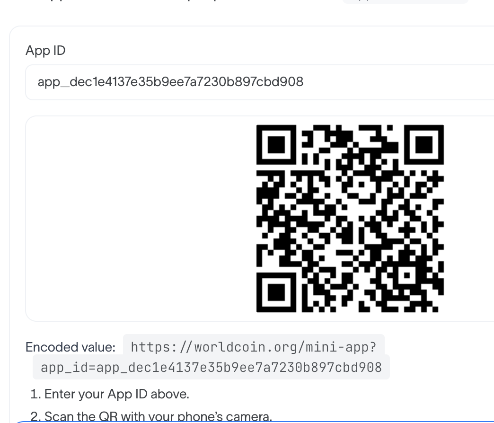

# Creditz Demo

This folder is for demo assets, recording notes, and the final video.

## Mini App Access

Use the QR/App ID artifact at:



```text
../AppID.png
```

`AppID.png` includes:

- the World Developer Portal App ID,
- the Mini App URL,
- the QR code for opening Creditz in World App.

Open the image on a laptop or share it with a phone, then scan the QR from World App to launch the Mini App.

## Recording Checklist

1. Register with World ID.
2. Issue or reload Credits from `/issuer`.
3. Create a merchant QR invoice from `/merchant`.
4. Pay from `/spend`.
5. Show `/debug` with commitments, spent nullifiers, merchant, and invoice state.
6. Replay the same invoice and show that it fails.

## Onchain Data

The contracts that records the commitments and the nullifiers can be seen at https://sepolia.worldscan.org/address/0xd33aff8861477f657c1f32b352a825d91eda31f5 .

## Video

The demo video can be downloaded [here](./Creditz.mov) or viewed on [YouTube](https://youtu.be/bug1XJ2FtrU).
